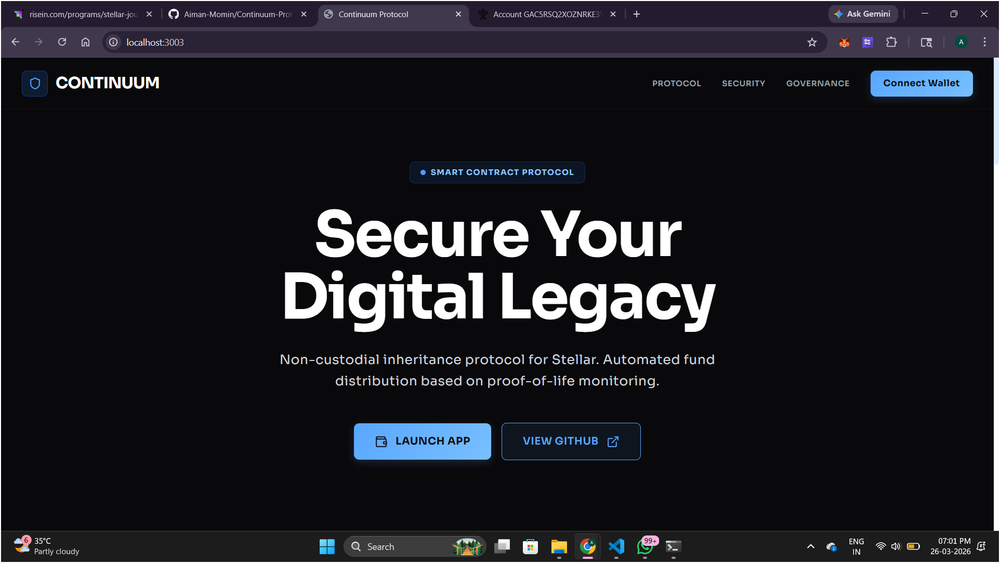
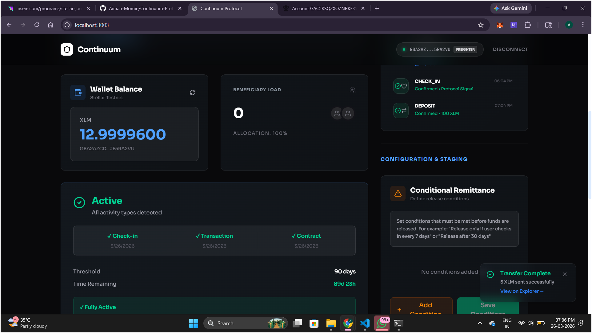
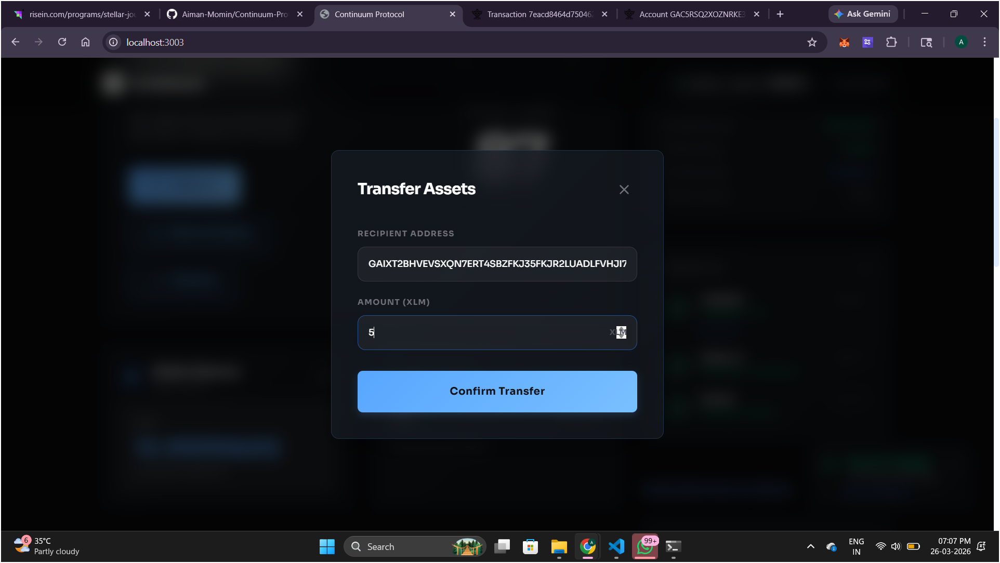
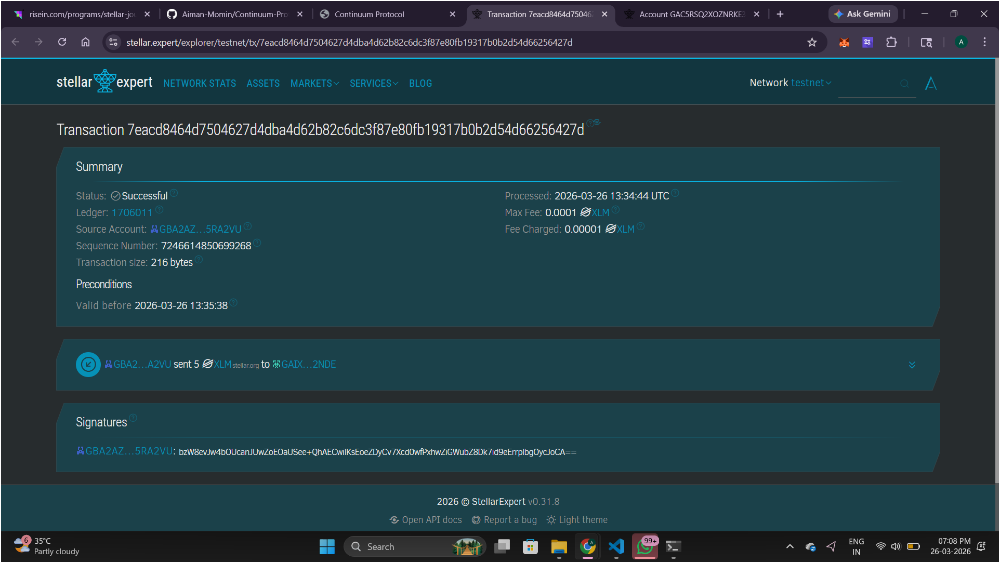
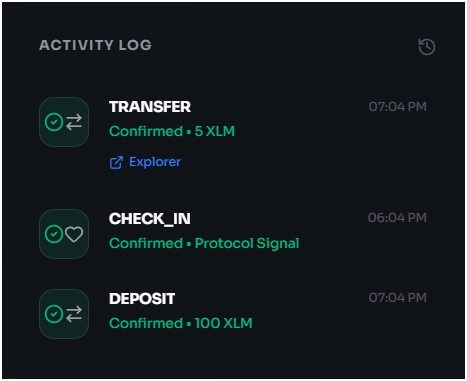

# Continuum Protocol: Design Blueprint

## Executive Summary
Continuum Protocol is a decentralized inheritance and inactivity management system built on the Stellar blockchain. It addresses the "Digital Death" problem—where crypto assets are lost forever if a user loses access or passes away—by providing a programmable, secure, and staged distribution mechanism.

---
## Features

# Wallet Integration
Connect/disconnect wallet (Freighter + MetaMask Snap)
Multi-wallet selection interface
Secure transaction signing
# Balance & Transactions
Fetch real-time XLM balance
Send XLM transactions on Stellar Testnet
Transaction feedback:
Success / Failure
Transaction hash
# Proof-of-Life System
“Check-In” mechanism using on-chain transactions
Activity logging via transaction history
Foundation for inactivity tracking
# Smart Contract Integration (Soroban)
Deployed smart contract on Stellar Testnet
Read & write data from frontend
Example: SimpleStorage contract (set/get value)
# Real-Time Synchronization
Polling mechanism for contract state updates
UI auto-refreshes contract values
# Transaction Tracking
Displays transaction history
Explorer links for verification

## Tech Stack
Frontend: React (TypeScript, Vite)
Blockchain SDK: Stellar SDK
Wallets: Freighter + MetaMask (Stellar Snap)
Smart Contracts: Soroban (Rust)
Styling: Tailwind CSS

## 📸 Screenshots

### Landing Page

### Balance Displayed

### Initiating Transaction

### Successful Transaction

### Proof of Life

## Smart Contract Details
Contract Address:
<CBY2L5ADWFW2RPABNLCWDWSM7IHKKJ2XM6H4GT2E5H5KSFXHDBOLY6OP>
# Verify on Stellar Explorer:
https://stellar.expert/explorer/testnet/contract/CBY2L5ADWFW2RPABNLCWDWSM7IHKKJ2XM6H4GT2E5H5KSFXHDBOLY6OP
## ⚠️ Error Handling

The application handles:

Wallet not installed
User rejected transaction
Insufficient balance
Contract interaction failures

Note: MetaMask Stellar Snap may occasionally fail to sign transactions due to current limitations. Freighter is fully supported and recommended.

## How It Works
User connects wallet
App fetches balance from Stellar Testnet
User sends XLM or interacts with contract
Transactions are signed and submitted
Contract state updates and UI syncs in real-time
Proof-of-Life actions are recorded on-chain

## Live Demo
https://continuum-protocol.vercel.app/

## Run Locally
Prerequisites
Node.js
Freighter Wallet (Testnet enabled)

# Setup
npm install
npm run dev

Crypto assets shouldn’t disappear with their owners.

Continuum Protocol ensures your digital legacy is preserved and passed on securely, automatically, and exactly as intended.

It’s not just a wallet, it’s financial continuity on-chain.